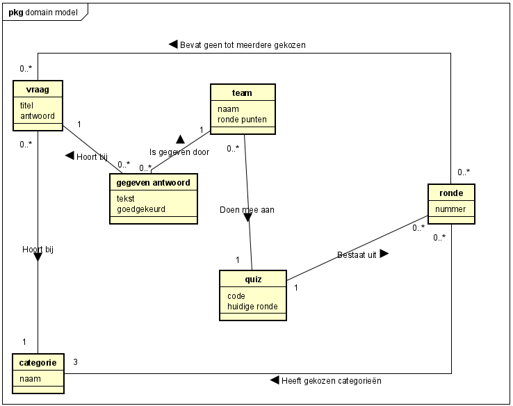
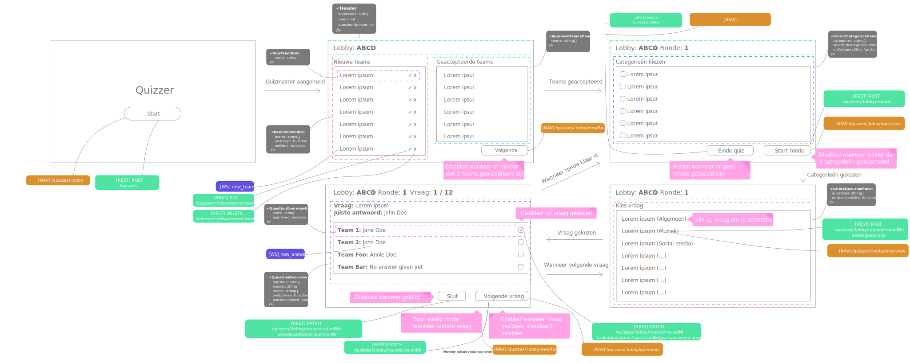
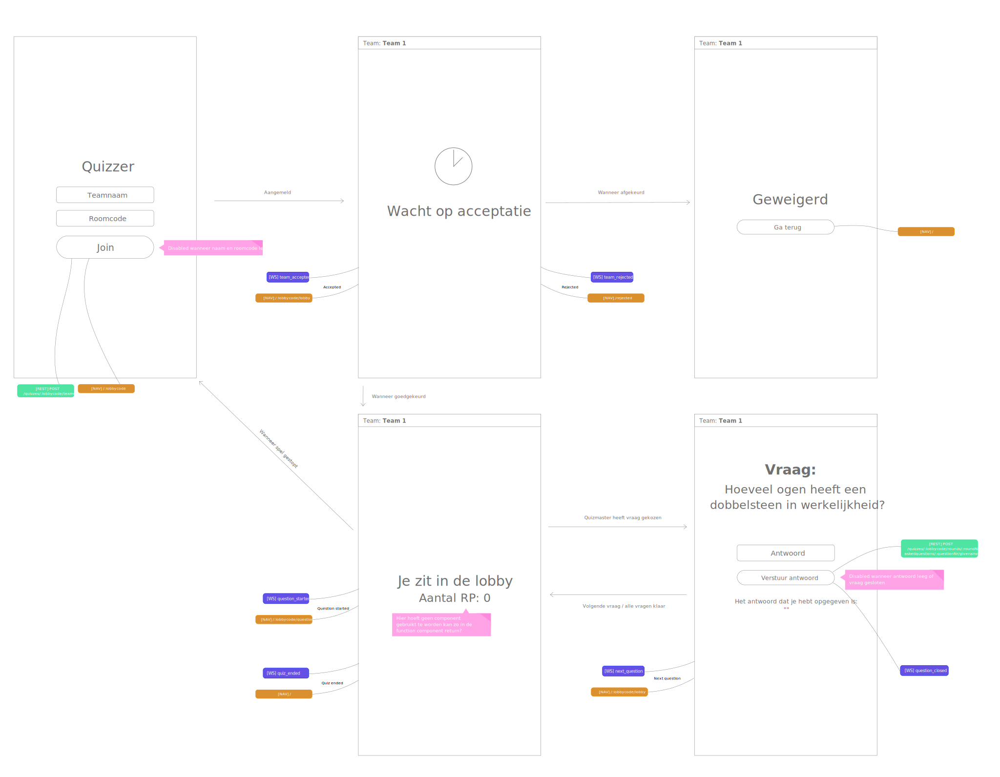
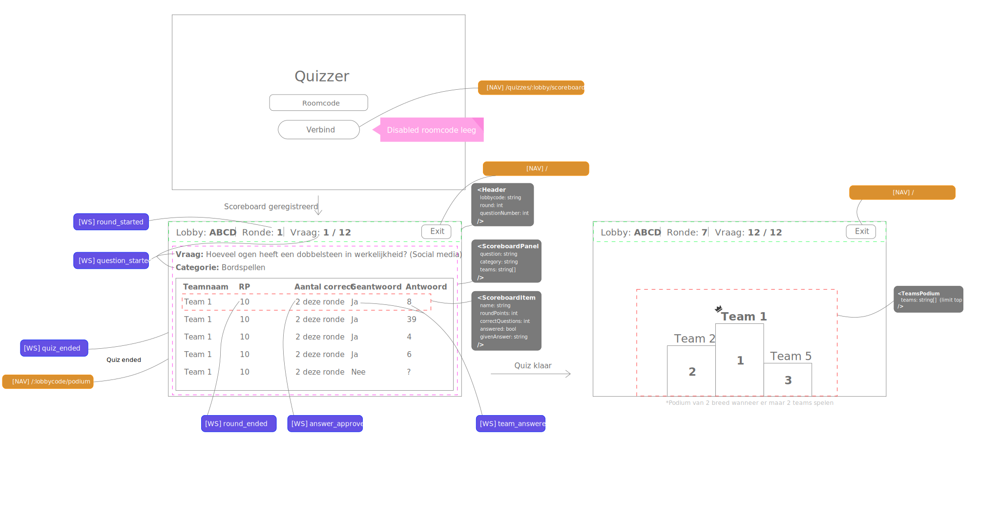

> DISCLAIMER: This documentation is not actual to how the code is currently built, but was only to make the development process with multiple people easier. The server files can be found in the server repository.

# Software Guidebook Quizzer
This is a simple software guidebook for our quiz application.
This application is made for education purposes.
The quiz application can be used in for example bars, at parties and even in prisons.

## Table of contents
<!-- TOC -->
* [Software Guidebook Quizzer](#software-guidebook-quizzer)
    * [Table of contents](#table-of-contents)
    * [Concepts](#concepts)
    * [Requirements](#requirements)
        * [Functional](#functional)
        * [Non-Functional](#non-functional)
    * [User interface wireframes](#user-interface-wireframes)
        * [Quizmaster](#quizmaster)
        * [Team](#team)
        * [Scoreboard](#scoreboard)
    * [Protocols](#protocols)
        * [List of REST endpoints](#list-of-rest-endpoints)
            * [Quizmaster](#quizmaster)
            * [Team](#team)
            * [Scoreboard](#scoreboard)
        * [REST endpoint specification](#rest-endpoint-specification)
    * [Data storage](#data-storage)
    * [Code](#code)
<!-- TOC -->

---

## Concepts


---

## Requirements
The requiremens are written in Dutch and divided in four categories:
M - must haves: These are the requirements that are necessary for the application to work.
S - should haves: These are the requirements that the application must have to have but not necessary for the application to work.
C - could haves: These are the requirements that are nice to have but not necessary. Can be seen as optional.
W - won't haves: These are the requirements that will not be built.

### Functional
- Een team moet toe kunnen treden tot een quiz door middel van een lobbycode en teamnaam **(Must)**
- Een team moet vragen kunnen beantwoorden van een ronde **(Must)**
- Een team moet een gegeven antwoord bij kunnen werken **(Should)**
- Zodra een vraag is gesloten, mogen de teams niet meer kunnen antwoorden op deze vraag **(Must)**

- De quizmaster moet een quiz aan kunnen maken **(Must)**
- Een quizmaster moet team aanmeldingen kunnen beoordelen (accepteren/afwijzen) **(Must)**
- Een quizmaster moet de ronde kunnen starten door 3 categorieën te selecteren **(Must)**
- Een quizmaster moet vragen kunnen selecteren per ronde **(Must)**
- Een quizmaster moet de vraag kunnen sluiten **(Must)**
- Een quizmaster moet de gegeven antwoorden kunnen accepteren **(Must)**
- Aan het einde van de ronde moet het systeem de punten toekennen per team aan de hand van aantal vragen goed **(Must)**
- Een quizmaster moet aan het einde van een ronde kunnen besluiten om de quiz af te sluiten **(Must)**

- Op het scorebord moet de tussenstand voortdurend zichtbaar zijn **(Should)**
- Aan het einde van de quiz moet er op het scorebord zichtbaar zijn welke teams de top 3 hebben bereikt **(Should)**
- De teams moeten op zijn minst het behaalde puntenaantal kunnen zien na elke ronde **(Must)**

### Non-Functional
- Het toetreden tot een quiz kan door de lobbycode in te vullen. **(Must)**
- Het toetreden tot een quiz kan door een unieke link te gebruiken waar de lobbycode in zit. **(Could)**
- Een ronde moet bestaan uit 12 vragen **(Should)**
- Team namen moeten uniek zijn en mogen niet leeggelaten worden **(Should)**
- Lege antwoorden worden genegeerd door het systeem **(Should)**

- De opslag van data moet gebeuren in een mongodb database **(Should)**
- Alle invoer van gebruikers moet tbv *security* gevalideerd worden op zowel de client als de server. Dit kan met mongoose **(Must)**
- Communicatie zal met "tikjes" gebeuren. Dit houdt in dat de server met de websocket een event op de client triggert om de juiste data op te halen en acties uit te voeren **(Should)**

## User interface wireframes
### Quizmaster

### Team

### Scoreboard


---

## Protocols

### List of REST endpoints
#### Quizmaster
- [POST] /api/v1/quizzes
- [PATCH] /api/v1/quizzes/:lobby
- [PUT] /api/v1/quizzes/:lobby/teams/:teamID
- [DELETE] /api/v1/quizzes/:lobby/teams/:teamID
- [GET] /api/v1/quizzes/:lobby/teams
- [GET] /api/v1/categories
- [POST] /api/v1/quizzes/:lobby/rounds
- [POST] /api/v1/quizzes/:lobby/rounds/:roundNr/askedquestions
- [GET] /api/v1/quizzes/:lobby/rounds/:roundNr/questions
- [GET] /api/v1/quizzes/:lobby/rounds/:roundNr/askedquestions/:questionNr
- [PATCH] /api/v1/quizzes/:lobby/rounds/:roundNr/askedquestions/:questionNr
- [PATCH] /api/v1/quizzes/:lobby/rounds/:roundNr/askedquestions/:questionNr/givenanswers/:answerId
- [GET] /api/v1/quizzes/:lobby/rounds/:roundNr/askedquestions/:questionNr/givenanswers
- [PATCH] /api/v1/quizzes/:lobby/rounds/:roundNr
#### Team
- [POST] /api/v1/quizzes/:lobby/teams
- [GET] /api/v1/quizzes/:lobby/teams/:teamID
- [POST] /api/v1/quizzes/:lobby/rounds/:roundNr/askedquestions/:questionNr/givenanswers
#### Scoreboard
- [GET] /api/v1/quizzes/:lobby/podium
- [GET] /api/v1/quizzes/:lobby

---

### REST endpoint specification

---

#### Quizmaster

---

> **`GET`** `/api/v1/quizzes/:lobby/teams`
Get all teams.

_parameters_

> **`lobby`** `string` - The lobby code of the quiz.

_returns_

```json
{
  "teams": [
    {
      "name": String,
      "roundPoints": String,
      "accepted": Boolean
    }
  ],
}
```

---

> **`GET`** `/api/v1/categories`
Get all the categories that are available in the application.

_parameters_

none

_returns_

```json
{
  "categories": [String],
}
```

---

> **`GET`** `/api/v1/quizzes/:lobby/rounds/:roundNr/questions`
Get all available questions for the round.

_parameters_

> **`lobby`** `string` - The lobby code of the quiz.<br>
> **`roundNr`** `string` - The round number of the quiz.

_returns_

```json
{
  "questions": [
    {
      "_id": ObjectID,
      "question": String,
      "answer": String,
      "category": String
    }
  ],
}
```

---

> **`GET`** `/api/v1/quizzes/:lobby/rounds/:roundNr/askedquestions/:questionNr`
Get details of asked question.

_parameters_

> **`lobby`** `string` - The lobby code of the quiz.  
> **`roundNr`** `string` - The round number of the quiz.  
> **`questionNr`** `string` - The question number.

_returns_

```json
{
  "askedQuestion": {
    "_id": ObjectID,
    "question": {
      "_id": ObjectID,
      "question": String,
      "answer": String, /// Depends on the client if this is given back
      "category": String
    }
  },
  "closed": Boolean,
}
```

---

> **`GET`** `/api/v1/quizzes/:lobby/rounds/:roundNr/askedquestions/:questionNr/givenanswers`
Get all given answers for an asked question.

_parameters_

> **`lobby`** `string` - The lobby code of the quiz.  
> **`roundNr`** `string` - The round number of the quiz.  
> **`questionNr`** `string` - The question number.

_returns_

```json
{
  "givenAnswers": [
    {
      "_id": ObjectID,
      "answer": String,
      "isCorrect": Boolean,
      "team": {
        "_id": ObjectID,
        "name": String,
        "roundPoints": Number,
        "accepted": Boolean
      }
    }
  ]
}
```

---

> **`POST`** `/api/v1/quizzes`
Create a new quiz.

_parameters_

none

_returns_

```json
{
  "lobby": String,
}
```

---

> **`POST`** `/api/v1/quizzes/:lobby/rounds`
Start a new round.

_parameters_

> **`lobby`** **`string`** - The lobby code of the quiz.

_body_

```json
{
  "chosenCategories": [String]
}
```

_returns_

```json
{
  "round": {
    "_id": ObjectID,
    "chosenCategories": [String]
  }
}
```

---

> **`POST`** `/api/v1/quizzes/:lobby/rounds/:roundNr/askedquestions`
Start a new question.

_parameters_

> **`lobby`** **`string`** - The lobby code of the quiz.  
> **`roundNr`** **`string`** - The round number of the quiz.

_body_

```json
{
  "question_id": String
}
```

_returns_

```json
{
  "askedQuestion": {
    "_id": ObjectID,
    "question": {
      "_id": ObjectID,
      "question": String,
      "answer": String,
      "category": String
    }
  }
}
```
---
> **`PATCH`**   
> `/api/v1/quizzes/:lobby`  
Close a quiz.

_parameters_

> **`lobby`** **`String`** - The lobby code of the quiz.

_returns_

none

---

> **`PATCH`** `/api/v1/quizzes/:lobby/rounds/:roundNr/askedquestions/:questionNr`
Lock the specified asked question

_parameters_

> **`lobby`** `string` - The lobby code of the quiz.  
> **`roundNr`** `string` - The round number of the quiz.  
> **`questionNr`** `string` - The question number of the quiz.

_body_

```json
{
  "closed": Boolean
}
```

_returns_

none

---

> **`PATCH`** `/api/v1/quizzes/:lobby/rounds/:roundNr/askedquestions/:questionNr/givenanswers/:answerId`
Approve the specified given answer

_parameters_

> **`lobby`** `string` - The lobby code of the quiz.  
> **`roundNr`** `string` - The round number of the quiz.  
> **`questionNr`** `string` - The question number of the quiz.
> **`answerId`** `string` - The id of the given answer.

_body_

```json
{
  "isCorrect": Boolean
}
```

_returns_

none

---

> **`PATCH`** `/api/v1/quizzes/:lobby/rounds/:roundNr`
Finish the specified round

_parameters_

> **`lobby`** `string` - The lobby code of the quiz.  
> **`roundNr`** `string` - The round number of the quiz.

_body_

```json
{
  "finished": Boolean
}
```

_returns_

none

---

> **`PUT`**  
> `/api/v1/quizzes/:lobby/teams/:teamID`  
> Accept a team.

_parameters_

> **`lobby`** **`String`** - The lobby code of the quiz.  
> **`teamID`** **`String`** - The team ID.

_returns_

none

---

> **`DELETE`**  
> `/api/v1/quizzes/:lobby/teams/:teamID`  
> Reject a team.

_parameters_

> **`lobby`** **`String`** - The lobby code of the quiz.  
> **`teamID`** **`String`** - The team ID.

_returns_

none

---

#### Team

---

[//]: # (TODO: Add reference to quizer get question)
> **`GET`**   
> `/api/v1/quizzes/:lobby/teams/:teamID`  
> Get team information.

_parameters_

> **`lobby`** `String` - The lobby code of the quiz.  
> **`teamID`** `String` - The team ID.

_returns_

```json
{
  "team": {
    "_id": ObjectId,
    "name": String,
    "roundPoints": Number,
    "Accepted": Boolean
  }
}
```

---

> **`POST`**   
> `/api/v1/quizzes/:lobby/teams`  
> Create a new team.

_parameters_

> **`lobby`** `String` - The lobby code of the quiz.

_body_

```json
{
  "name": String
}
```

__returns__

```json
{
  "team": {
    "_id": ObjectId,
    "name": String,
    "roundPoints": Number,
    "Accepted": Boolean
  }
}
```

---
> **`POST`**  
> `/api/v1/quizzes/:lobby/rounds/:roundNr/askedquestions/:questionNr/givenanswers`  
> Give a new answer to a question.

_parameters_

> **`lobby`** `String` - The lobby code of the quiz.  
> **`roundNr`** `Number` - The round number of the quiz.  
> **`questionNr`** `Number` - The question number being asked in the quiz.

_body_

```json
{
  "answer": String
}
```

__returns__

none

---

#### Scoreboard

---

> **`GET`**   
> `/api/v1/quizzes/:lobby/`  
> Get scoreboard information.

_parameters_

> **`lobby`** `String` - The lobby code of the quiz.

_returns_

```json
{
  "lobby": String,
  "teams": [
    {
      "_id": ObjectId,
      "name": String,
      "roundPoints": Number,
      "Accepted": Boolean
    }
  ],
  "round": [
    {
      "askedQuestions": [
        {
          "closed": Boolean,
          "question": {
            "_id": ObjectId,
            "question": String,
            "answer": String,
            "category": String,
          },
        "givenAnswers": [
            {
                "_id": ObjectId,
                "answer": String,
                "team": {
                    "_id": ObjectId,
                    "name": String,
                    "roundPoints": Number,
                    "Accepted": Boolean
                },
                "isCorrect": Boolean
            }
            ]
        ]
        }
      ]
    }
  ]
}
```

---
> **`GET`**   
> `/api/v1/quizzes/:lobby/podium`  
> Get scoreboard podium.

_parameters_

> **`lobby`** `String` - The lobby code of the quiz.

_returns_

```json
{
  "teams": [
    {
      "_id": ObjectId,
      "name": String,
      "roundPoints": Number,
      "Accepted": Boolean
    }
  ]
}
```

---

## Data storage
- Schema met vragen [questionSchema.js](./quizzer_server/src/schemas/questionSchema.js)
- Schema met teams [teamSchema.js](./quizzer_server/src/schemas/teamSchema.js)
- Schema met quizzes [quizSchema.js](./quizzer_server/src/schemas/quizSchema.js)
    - Schema met rondes [roundSchema.js](./quizzer_server/src/schemas/roundSchema.js)
        - Schema met gestelde vragen [askedQuestionSchema.js](./quizzer_server/src/schemas/askedQuestionSchema.js)
            - Schema met gegeven antwoorden [givenAnswerSchema.js](./quizzer_server/src/schemas/givenAnswerSchema.js)

---

## Code

### Client REDUX state

#### Quizmaster
```javascript
{
    lobbyCode: String,
    roundNumber: String,
    questionNumber: String,
    teams: [{
        _id: Number,
        name: String,
        roundPoints: Number,
        accepted: Boolean
    }],
    askedQuestion: {
        _id: Number,
        question: {
            _id: Number,
            question: String,
            answer: String,
            category: String
        },
        closed: Boolean
    },
    givenAnswers: [{
        _id: Number,
        answer: String,
        team: {
            _id: Number,
            name: String,
            roundPoints: Number,
            accepted: Boolean
        },
        isCorrect: Boolean
    }]
}
```

#### Team
```javascript
{
    lobbyCode: String,
    teams: [{
        _id: Number,
        name: String,
        roundPoints: Number,
        accepted: Boolean
    }],
    askedQuestion: {
        _id: Number,
        question: {
            _id: Number,
            question: String,
            category: String
        },
        closed: Boolean
    },
    currentAnswer: String
}
```


#### Scoreboard
```javascript
{
    lobbyCode: String,
    teams: [{
        _id: Number,
        name: String,
        roundPoints: Number,
        accepted: Boolean
    }],
    rounds: [
        {
            askedQuestions: [
                {
                    closed: Boolean,
                    question: {
                        _id: Number,
                        question: String,
                        answer: String,
                        category: String
                    },
                    givenAnswers: [
                        {
                            _id: Number,
                            answer: String,
                            team: {
                                _id: Number,
                                name: String,
                                roundPoints: Number,
                                accepted: Boolean
                            },
                            isCorrect: Boolean
                        }
                    ]
                }
            ],
            finished: Boolean
        }
    ],
    askedQuestion: {
        _id: Number,
        question: {
            _id: Number,
            question: String,
            category: String
        },
        closed: Boolean
    },
    currentAnswer: String
}
```

---

## Express router
For this applications we have decided to create different express routers based on the resource they have. Depending on the route they will be categorized in different router files. For example /quizzes, /teams, and /questions will all be in different routers. If router files will become unclear and messy we can decide to further split them up in more files if that makes the code more clean.
